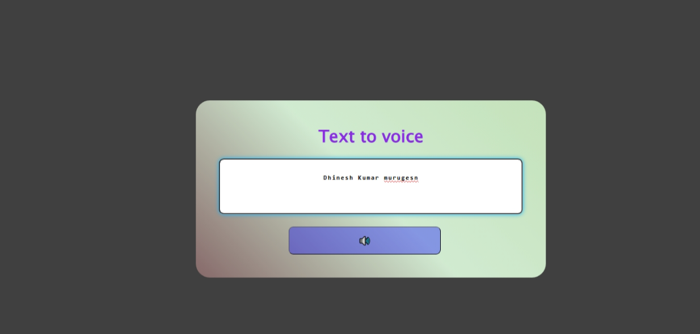

# 🔊 Text to Voice Converter

This is a beginner-friendly web application that converts written text into speech using the browser's built-in Speech Synthesis API.

🌐 **Live Demo:** [Click here to try it](https://msdhinesh45.github.io/text-to-voice-website/) <!-- Update if hosted -->

---

## 📌 Features

- ✍️ Type any text
- 🎧 Click the speaker button to hear the audio
- 🗣️ Supports English (UK) accent
- ⚙️ Adjustable speech rate, pitch, and volume
- 💻 Simple and clean user interface

---

---

## 🚀 How to Use

1. Open the [live website](https://msdhinesh45.github.io/text-to-voice/)
2. Enter text in the box
3. Click the 🔊 button to hear the text read aloud

---

## 🛠️ Technologies Used

- HTML
- CSS
- JavaScript
- Web Speech API (`SpeechSynthesisUtterance`)

---

## 📸 Screenshot
    
  

---

## 👨‍💻 Developed By

**Dhinesh Kumar**  
[GitHub Profile](https://github.com/msdhinesh45)

---

⭐️ Star this repo if you found it useful!
